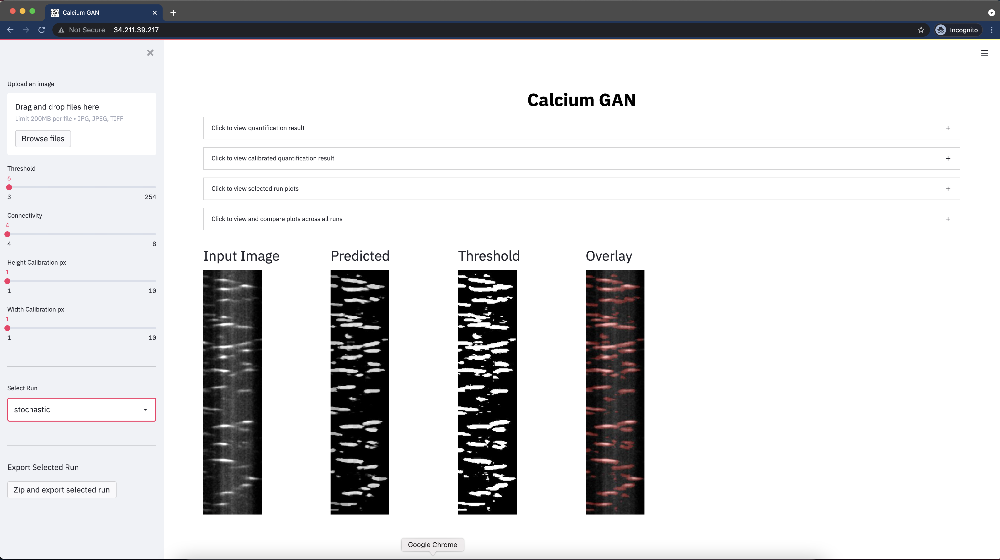
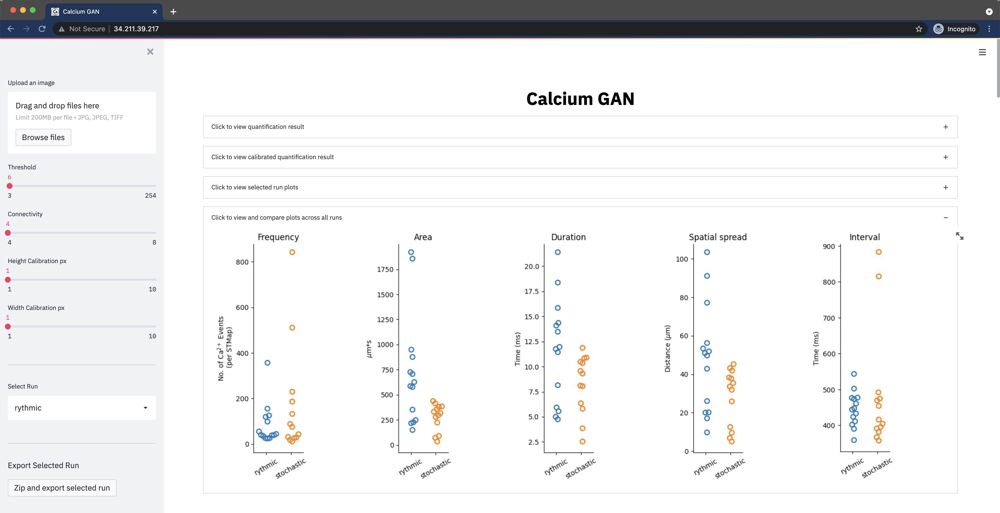

# 4SM: Subcellular Signal Segmenting Spatiotemporal Model

This code is part of our paper 4SM: New open-source software for subcellular segmentation and analysis of spatiotemporal fluorescence signals using deep learning" and is currently under review.

The authors of the papers are <b>Sharif Amit Kamran, Khondker Fariha Hossain, Hussein Moghnieh, Sarah Riar, Allison Bartlett, Alireza Tavakkoli, Kenton M Sanders and Salah A. Baker</b>

The code is authored and maintained by Sharif Amit Kamran [[Webpage]](https://www.sharifamit.com/) and Hussein Moghnieh [[Webpage]](https://medium.com/@husseinmoghnie).

# Graphical User Interface
The code uses streamlit library to provide a graphical user interface for ease of use

## Stochastic image processing
  
  
## Plotting the results of multiple processed images

## Pre-requisite
- Ubuntu 18.04 / Windows 7 or later
- NVIDIA Graphics card

## Instructions for Installation and Running the App  
- [Windows](installation_guides/Windows_Installation_Guide.md)
- [Ubuntu](installation_guides/Ubuntu_Instllation_Guide.md)  
- [Google Colab](https://colab.research.google.com/drive/1mlmrOho8D5Cd-eqlV-aZHAYAY-EpEjmj?usp=sharing)

# License
The code is released under the GPL-2 License, you can read the license file included in the repository for details.
