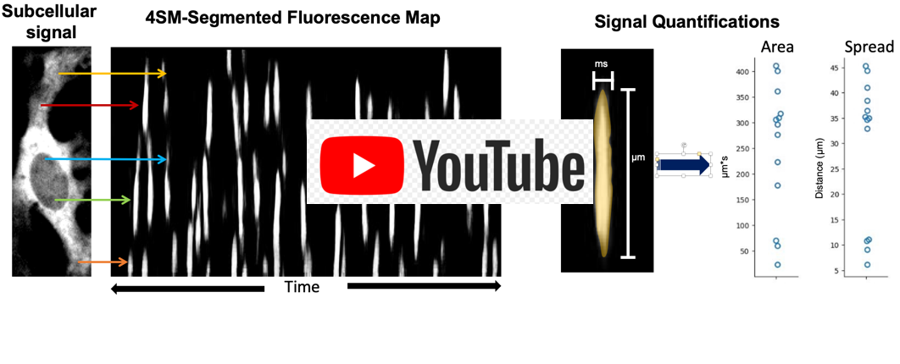

<h4 align="center">
  4SM: Subcellular Signal Segmenting Spatiotemporal Model   
</h4>

<div align="center">
  <a href="#installation-guide"><b>Installation Guide</b></a> |
  <a href="#usage"><b>Usage Guide</b></a> |
  <a href="https://github.com/SharifAmit/4SM/tree/main/examples/image_dataset/"><b>Test Dataset</b></a> |
  <a href="https://www.youtube.com/watch?v=t2LsQkyAGQc" target="4SM tutorial"><b>4SM Installation and Demo on YouTube</b></a>
</div>


<br/>

# 4SM: Subcellular Signal Segmenting Spatiotemporal Model <a href="https://zenodo.org/badge/latestdoi/392980422"></a>

This code is part of our paper **4SM: New open-source software for subcellular segmentation and analysis of spatiotemporal fluorescence signals using deep learning** and has been accepted to [iScience](https://www.cell.com/iscience/fulltext/S2589-0042(22)00547-8).

### iScience 
```
https://www.cell.com/iscience/fulltext/S2589-0042(22)00547-8
```
The authors of the papers are <b>Sharif Amit Kamran, Khondker Fariha Hossain, Hussein Moghnieh, Sarah Riar, Allison Bartlett, Alireza Tavakkoli, Kenton M Sanders and Salah A. Baker</b>

The code is authored and maintained by Sharif Amit Kamran [[Webpage]](https://www.sharifamit.com/) and Hussein Moghnieh [[Webpage]](https://medium.com/@husseinmoghnie).

### Citation 

```
@article{KAMRAN2022104277,
title = {New open-source software for subcellular segmentation and analysis of spatiotemporal fluorescence signals using deep learning},
journal = {iScience},
pages = {104277},
year = {2022},
issn = {2589-0042},
doi = {https://doi.org/10.1016/j.isci.2022.104277},
url = {https://www.sciencedirect.com/science/article/pii/S2589004222005478},
author = {Sharif Amit Kamran and Khondker Fariha Hossain and Hussein Moghnieh and Sarah Riar and Allison Bartlett and Alireza Tavakkoli and Kenton M. Sanders and Salah A. Baker}
}
```

# Abstract

To understand cellular dynamics in fluorescence imaging, we need a fast, accurate, and reliable software or tool. In recent times, Deep learning has advanced biomedical image analysis and consistently achieved state-of-the-art accuracy by learning from high volumes of data. Despite these advances, there has been little to no application in the segmentation of subcellular fluorescein signals. Spatio-temporal maps (STMaps) are a transformed version of dynamic cellular signals recordings, visualized by an image of a function of time and space. Current approaches of segmentation and quantification of these images are time-consuming and require an expert annotator. To alleviate this, we propose an open-source software called "4SM" that incorporates a novel deep-learning methodology to segment subcellular fluorescein signals with high accuracy. Moreover, the tool provides a fast, robust, and consistent data analysis and retrieval pipeline that can accommodate different patterns of signals across multiple cell types. In addition, the software allows the user to experience seamless data accessibility, quantification, graphical visualization and allows high throughput for large datasets. 

[](https://www.youtube.com/watch?v=t2LsQkyAGQc)


# Installation Guide

## Pre-requisite

- CUDA version 10.0
- List of NVIDIA Graphics cards supporting CUDA 10.0
      https://gist.github.com/standaloneSA/99788f30466516dbcc00338b36ad5acf

## Installing and Running 4SM
- [Windows](docs/Windows_Installation_Guide.md)
- [Linux 64 / Ubuntu 18](docs/Ubuntu_Instllation_Guide.md)  
- [Google Colab](https://colab.research.google.com/drive/1mlmrOho8D5Cd-eqlV-aZHAYAY-EpEjmj?usp=sharing)

## Installation Instructions and Demo on YouTube
[](https://www.youtube.com/watch?v=t2LsQkyAGQc)


# Usage
4SM is web-based easy to use graphical interface for subcellular segmentation and analysis of spatiotemporal fluorescence signals using deep learning

### Input:

- **Threshold :**
As the predicted image is a probability map with values between 0 to 255. The user can pick a threshold value  (= 1 to 254) to make this image into a binary image with values of 0 and 255.

- **Connectivity:**
The connectivity ( = 4 or 8)  is a post-processing step for doing quantification using connected-components. So the connectivity checks either 4 neighboring pixels or 8 neighborhoods pixels for doing this quantification. Using this connected component we can count how many independent calcium transient events there are and the duration, spread, area and interval of these events.

- **Stride:**
4SM creates multiple small patches of image by using fixed sized overlapping crops from one test image. The image size can vary, but the crop size is fixed ( 64x64). By default we use a stride size of 3. However, having a larger stride will create a small number of crops from each test image and a smaller stride will yield a larger number of cropped images. Contrarily, larger strides will give faster yet poor visual results, whereas smaller strides will give slower yet high-quality visual results.
    For example: Given Image size = 128 x 128, if we choose stride= 64, then the number of cropped images will be 4. If the stride = 8, the number of cropped images will be 81. 

**4SM is optimized for 8-bit gray-scale images of JPEG, PNG and TIFF formats**

### Segmentation Output:
   

### Quantification Results of the Segmented Images
    

### Control Panel
  

# License
The code is released under the GPL-2 License, you can read the license file included in the repository for details.
