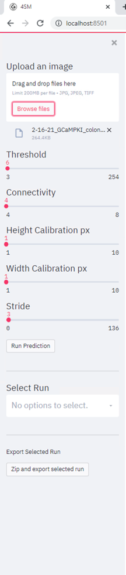

<h4 align="center">
  4SM: Subcellular Signal Segmenting Spatiotemporal Model
</h4>

<div align="center">
  <a href="#installation"><b>Installation</b></a> |
  <a href="#usage"><b>Usage</b></a> |
  <a href="https://github.com/SharifAmit/4SM/tree/main/examples/tutorial#tutorial-1"><b>Tutorial</b></a> |
  <a href="https://github.com/SharifAmit/4SM/tree/main/examples"><b>Examples</b></a> |
  <a href="https://www.youtube.com/"><b>Youtube FAQ</b></a>
</div>

<br/>


# 4SM: Subcellular Signal Segmenting Spatiotemporal Model

This code is part of our paper **4SM: New open-source software for subcellular segmentation and analysis of spatiotemporal fluorescence signals using deep learning** and is currently under review.

The authors of the papers are <b>Sharif Amit Kamran, Khondker Fariha Hossain, Hussein Moghnieh, Sarah Riar, Allison Bartlett, Alireza Tavakkoli, Kenton M Sanders and Salah A. Baker</b>

The code is authored and maintained by Sharif Amit Kamran [[Webpage]](https://www.sharifamit.com/) and Hussein Moghnieh [[Webpage]](https://medium.com/@husseinmoghnie).

# Abstract

Advancements in cellular imaging instrumentation and the availability of optogenetic and
fluorescence probes tools have yielded a profound need for fast, accurate, and standardized
analysis. Deep learning architectures have revolutionized the field of biomedical image analysis
and consistently achieved state-of-the-art accuracy by learning from high volumes of data.
Despite these advances, their application in segmentation of subcellular fluoroscein 
signals is much needed. Cellular dynamic fluorescence signals can be plotted and visualized as a
function of time and space in spatiotemporal maps (STMaps) and currently their segmentation
and quantification are susceptible to user bias and hindered by slow workflow speed and lack of
accuracy, especially for large datasets. In this study, we provide an open-source software tool
that utilizes, at its core, a novel deep-learning methodology to fundamentally overcome
segmentation of subcellular fluoroscein  signals challenges. The software framework
demonstrates a high level of accuracy in segmenting calcium fluoroscein  signals and
simultaneously provides a fast analysis pipeline and consistent data retrieval that can
accommodate different patterns of signals across multiple cell types. The software allows
seamless data accessibility, quantification, graphical visualization and enables large dataset
analysis throughput.

# Graphical User Interface
The code uses streamlit library to provide a graphical user interface for ease of use

## Stochastic image processing
  
  
## Plotting the results of multiple processed images


## Image Segmentation
  

## Control Panel
  

# Installation Guide


## Pre-requisite
- Ubuntu 18.04 or later / Windows 7 or later
- NVIDIA Graphics card
    - **Supports** : NVIDIA Pascal (P100, GTX10**), Volta (V100), Turing (GTX 16**, RTX 20**, Quadro)
    - **Does not support** : NVIDIA Amphere (RTX 30**, A100) [In Development]

### Google Colab
- [Google Colab](https://colab.research.google.com/drive/1mlmrOho8D5Cd-eqlV-aZHAYAY-EpEjmj?usp=sharing)


### Anaconda
You need to install [Anaconda](https://www.anaconda.com/products/individual), then run below:

```bash
# python3
conda create --name=4sm python=3.7
conda activate 4sm
conda install -y tensorflow-gpu=2.0.0
pip install tensorflow-estimator==2.0.0
conda install -y keras=2.3.1
pip install streamlit==0.86.0
pip install streamlit-aggrid==0.2.1
pip install opencv-python
pip uninstall -y scikit-learn
pip install scikit-learn==0.20.4
pip install pycm
pip install h5py==2.10.0 --force-reinstall
pip install matplotlib==3.5.1
pip install seaborn==0.11.2
```

### Usage
After install all the dependencies, run the following command to start the web based user interface
```
streamli run ./src/web_streamlit.py --server.port=8080
```

The user interface is accessible through a web browser (make sure not to use old internet explorer version)


##Troubleshooting
### Ubuntu
```
ImportError: libGL.so.1: cannot open shared object file: No such file or directory
```
Run
```
apt-get update && apt-get install -y python3-opencv
```

### Windows


# License
The code is released under the GPL-2 License, you can read the license file included in the repository for details.
