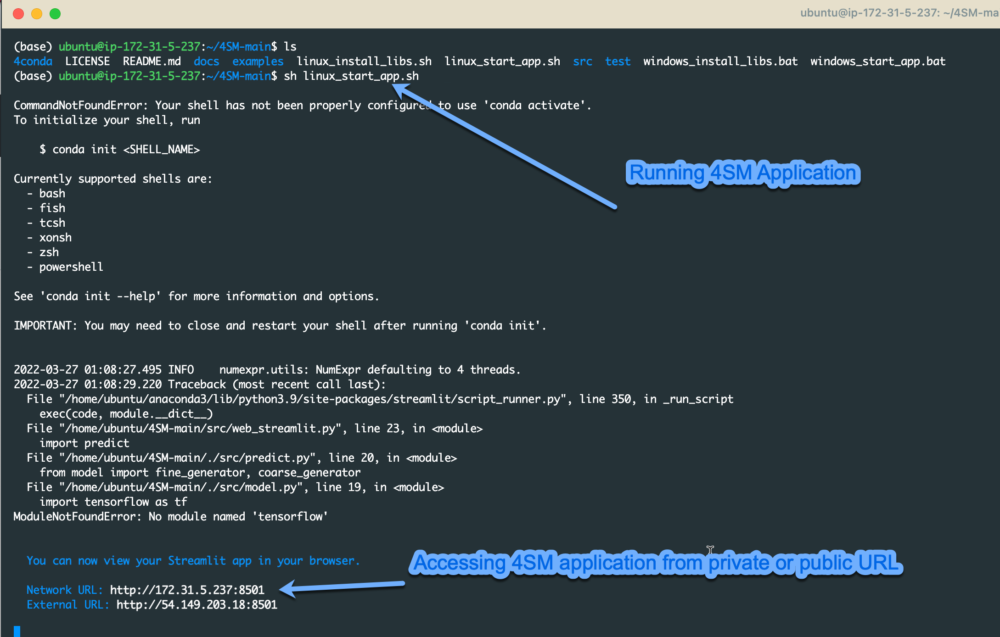

# Ubuntu 18 / Linux 64 Installation

### Pre-requisite
- Ubuntu 18.04 or later
- **Supports** : NVIDIA Pascal (P100, GTX10**), Volta (V100), Turing (GTX 16**, RTX 20**, Quadro)
- **Does not support** : NVIDIA Amphere (RTX 30**, A100) [In Development]

### 1. Download and Install Anaconda from the following link

```
https://www.anaconda.com/products/individual
```
Make sure to export your conda bin folder to .bashrc
```
export PATH="/root/anaconda3/bin:$PATH"
```

### 2. Download and unzip the application from

[Click here to download 4SM application](https://github.com/SharifAmit/4SM/archive/refs/heads/main.zip)

### 3. Install Python libraries dependencies 

In the root folder of the unzipped project, run the following shell script
```
sh linux_install_libs.sh
```

  

This step will create Anaconda's environment and install all python dependencies

# Running the application
Run the following shell script in the root folder of the application
```
sh linux_start_app.sh
```

 

If you are running on a remote server, the application can be access from its public URL as shown above
A new browser will open with 4SM app running on the following URL:
[http://<server ip>:8501](http://<server IP>:8501)

Please note that if you are using an older version of Internet Explorer, copy the application URL and paste it in Google Chrome,  Microsoft Edge, or Firefox


## Common installation issues

### Ubuntu
```
ImportError: libGL.so.1: cannot open shared object file: No such file or directory
```
Run
```
apt-get update && apt-get install -y python3-opencv
```


